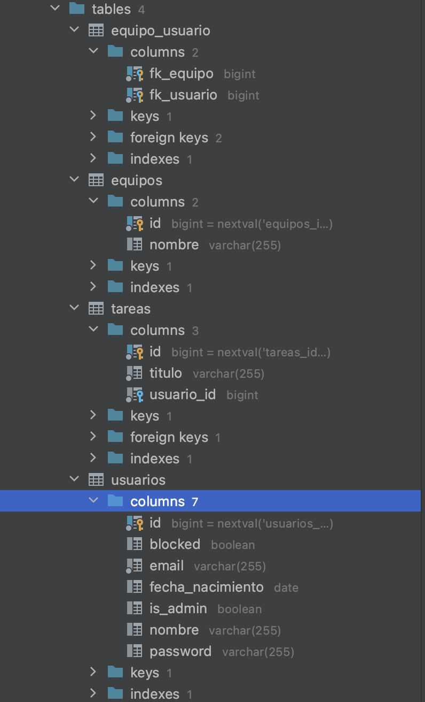

# Base de datos final

# 009 Gestionar pertenencia al equipo
En esta historia de usuario se pretende poder gestionar la pertenencia de los usuarios a los equipos de la aplicación. De esta forma, los usuarios se podrán añadir y eliminar de cualquier equipo o bien desde la pestaña `/equipos`, o desde la página de detalles del equipo.
### Modelos
- *Usuario*: Se ha creado el método `bool Usuario.perteneceEquipo(Equipo)` para comprobar de una manera más sencilla desde las plantillas Thymeleaf si un usuario pertenece al equipo enviado por parámetro
- *Equipo*: La clase equipo ahora tiene un método `removeUsuarioEquipo`, que permite eliminar un Usuario de la colección de Usuarios que pertenecen al equipo. Para actualizar la relación, también elimina el equipo de la lista del usuario.

### Servicios
- *EquipoService*: 
  1. `addUsuarioEquipo(Long, Long)`: Ahora produce una excepción del tipo EquipoServiceException si no encuentra el usuario o equipo con id proporcionado
  2. `removeUsuarioEquipo(Long, Long)`: Se ha creado el método que a partir del id de un usuario y equipo, elimina la relación de pertenencia. En caso de no encontrar el equipo o el usuario produce una excepcion de tipo EquipoServiceException.

### Rutas - Controladores
Para ambas rutas se ha gestionado un mecanismo de autenticación comprobando que el usuario que está logeando es el dueño del recurso. Esto lo hacemos gracias a la comprobación de la variable usuarioId de la URI con la del usuario logeado. Si es la misma, significa que el usuario qeu ejecuta la petición es el dueño del recurso, de no ser así se devuelve un código `401 Unauthorized`.
- `POST /equipos/@equipoId/usuarios/@usuarioId`: Establece la relación de pertenencia del usuario con el equipo.
- `POST /equipos/@equipoId/usuarios/@usuarioId`: Elimina la relación de pertenencia del usuario con el equipo.

De no ser encontrado el equipo o el usuario se devolverá un código HTTP `404 Not Found`

- `POST /equipos`: Con el uso de la clase también implementada *EquipoData* que recoge el nombre del formulario, llama al método de EquipoServicio.crearEquipo para crear un nuevo equipo. Esta ruta está protegida para usuarios logeados, y de encontrar que el formulario está el nombre vacío devuelve `400 Bad Request`
- `GET /equipos/nuevo`: Devuelve la plantilla formNuevoEquipo con el objeto EquipoData asociado al formulario.

### Vistas
- *detallesEquipo*: Se ha añadido el botón de Unirse o Abandonar el equipo, se muestra gracias al código `th:if="${usuario.perteneceEquipo(equipo)}`
- *listaEquipos*: Se ha añadido el botón que reedirige al formulario para crear el equipo. También se ha añadido el botón de unirse o abandonar equipo para cada columna que representa un equipo.
- *formNuevoEquipo*: Representa el formulario del equipo, realiza una acción `POST /equipos`. Tiene un campo de nombre.
### Tests
Al realizar desarrollo por TDD todas las funcionalidades añadidas han sido probadas previamente. Todos los tests que se han realizado se encuentran en las clases:
- EquipoTest
- EquipoWebTest
- EquipoServiceTest

En los modelos y los servicios se ha probado que las relaciones se actualizan. Para las vistas, que se mostraran los elementos en la respuesta HTML y para los controladores que actualizarán la información. También se ha probado todos los errores / excepciones contempladas.

# 010 Gestionar pertenencia al equipo
En esta historia de usuario se pretende que un usuario administrador sea capaz de eliminar un equipo o editar el nombre. 

### Modelos
- *Equipo*: Se ha añadido el método `setNombre(String)` necesario para actualizar el nombre de un Objeto equipo.
### Servicios
- *EquipoService*:
  1. `modificarEquipo(Long equipoId, String nombre)`: Haciendo uso del método añadido en el modelo equipo se actualiza el nombre. Si el nombre es nulo o no encuentra el equipo se produce una excepción de tipo `EquipoServiceException`
  2. `eliminarEquipo(Long equipoId)`: Elimina un equipo a partir de su id. Si no encuentra el equipo produce una excepción de tipo `EquipoServiceException`

### Rutas - Controladores
Todos los controladores están protegidos por un middleware de administrador, cuyo código es el siguiente:  
>     private void checkAdminUserLogged() {      
>        if (!managerUserSession.isUsuarioLogeado())
>            throw new UsuarioNoLogeadoException();
>        Long idUser = managerUserSession.usuarioLogeado();
>        Usuario u = usuarioService.findById(idUser);
>        if(!u.getIsAdmin()){
>            throw new UsuarioNoAdminException();
>       }
>      }

Haciendo una llamada a `checkAdminUserLogged()` antes de toda la lógica de los controladores, comprobaremos que solo se ejecutan en caso de que el usuario sea administrador. En caso contrario devolverá un `401 Unauthorized `

También se devolverá `404 Not Found` en caso de que no se encuentre el equipo o `401 Unauthorized` si no hay usuario logeado (aunque no sea admin)

- `GET /equipos/{id}/editar`: Muestra la plantilla formEditarEquipo y le añade el objeto EquipoData. El controlador hace `EquipoData.nombre = equipo.nombre` para que en el input se muestre el nombre actual del equipo y no salga vacío como sucedería al crearlo.
- `POST /equipos/{id}/editar`: Envía el objeto EquipoData rellenado, de ser el nombre vacio produce una respuesta de tipo `400 Bad Request`, y actualiza el nombre del equipo llamando al método creado en el servicio modificarEquipo.
- `DELETE /equipos/{id}`: Elimina el equipo con el id pasado por parámetro. Lo hace llamando al método de EquipoService, eliminarEquipo.

### Vistas
- *listaEquipos*: Se ha añadido con la condición `th:if=${usuario.isAdmin}` los botones de Modificar y Eliminar equipos para cada columna (equipo).
- *formEditarEquipo*: Se ha creado un formulario vinculado a EquipoData para editar un equipo, este llamará a la ruta `POST /equipos/{id}/editar`.

### Tests
Al igual que en la historia de usuario anterior, todas las funcionalidades han sido añadidas por TDD por lo que hay un test para cada caso de uso. Los tests se encuentran en las clases: 
- EquipoTest
- EquipoWebTest
- EquipoServiceTest

Se ha probado que tanto los modelos, servicios y controladores actualizan la información (mostrando errores si fuera necesario) y las vistas muestran los elementos que se han añadido.
 