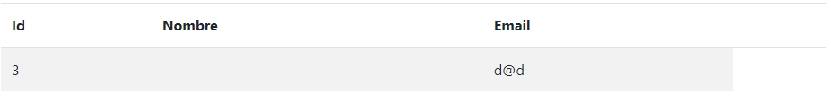
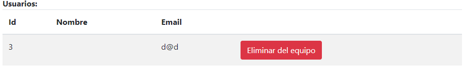

# Docker Hub
``` 
https://hub.docker.com/r/sergioaluua/mads-todolist-equipo15
```
# 012 Gestión de equipos por administradores
En esta historia se pretende que los administradores de la aplicación puedan eliminar a usuarios de un grupo. Anteriormente, para echar a un usuario era necesario eliminar el grupo entero, con esto no haría falta.
### Controladores
- *EquipoController*: Se ha actualizado el middleware `comprobarUsuarioLogeado`. Su antigua función era revisar que el id del usuario logeado coincidia con el parámetro que se le pasaba. Se utiliza en las funciones donde se accede a recursos de los usuarios, de esta forma comprobamos que si no es el mismo lanzamos una excepción con código `HTTP 401 Unauthorized`. Ahora si el usuario logeado es administrador no lanzamos la excepción y le permitimos acceder al recurso.
```java
private void comprobarUsuarioLogeado(Long idUsuario) {
    Long idUsuarioLogeado = managerUserSession.usuarioLogeado();
    if (!managerUserSession.isUsuarioLogeado())
        throw new UsuarioNoLogeadoException();
    Long idUser = managerUserSession.usuarioLogeado();
    Usuario u = usuarioService.findById(idUser);
    if(!u.getIsAdmin()) {
        if (!idUsuario.equals(idUsuarioLogeado))
            throw new UsuarioNoLogeadoException();
    }
}
```

De esta forma conseeguimos que el administrador pueda acceder al controlador `DELETE /equipos/{equipoId}/usuarios/{usuarioId}` que elimina el usuario del equipo.

### Vistas
- *detallesEquipo*: Se ha añadido en la vista un botón solo si el administrador está logeado para cada usuario de la tabla. Esto se hace gracias al código de Thymeleaf
```html
<td th:if="${usuario.isAdmin}">
    <button class="btn btn-danger btn-xs" onmouseover="" style="cursor: pointer;"
            th:onclick="'del(\'/equipos/' + ${equipo.id} + '/usuarios/' + ${usuarioEquipo.id} + '\')'">Eliminar del equipo</button>
</td>
```

La vista quedaría para usuarios sería así:

Y para administradores:


# 013 Información de entidades
En esta historia se pretende añadir una nueva funcionalidad a la vista `Acerca de` que contemple un seguimiento de los usuarios registrados, asi como las tareas y equipos que han sido creadas en nuestra aplicación.

### Rutas - Controladores
Modificado el método `about` para que añada tres nuevos atributos a la vista que calculen el numero de usuarios registrados en la aplicación, el número de tareas totales de los usuarios y el número de equipos totales que han sido creados.

- Calculo de los usuarios registrados y las tareas totales:
```java
Integer numberUser = 0;
        Integer numberTask = 0;
        for(Usuario u :usuarioService.findAll()) {
            numberUser++;
            for (Tarea t : tareaService.allTareasUsuario(u.getId())) {
                numberTask++;
            }
        }
```

### Vistas
- *about*: Añadidos tres elementos a la lista para mostrar el numero de usuarios registrados en la aplicación, el número de tareas totales de los usuarios y el número de equipos totales que han sido creados.
```html
<h1>ToDoList</h1>
      <ul>
        <li>Desarrollada por Equipo 15: </li>
        <li>Sergio Baeza Carrasco</li>
        <li>Eugenio Benito López</li>
        <li>Álvaro Lario Sánchez</li>
        <li>Versión 1.3.0-SNAPSHOT</li>
        <li>Fecha de release: en desarrollo</li>
        <li>Usuarios registrados: <span th:text="${numberUser}"></span></li>
        <li>Tareas registradas: <span th:text="${numberTask}"></span></li>
        <li>Equipos registrados: <span th:text="${numberTeam}"></span></li>
      </ul>
```

### Tests
Hemos añadido un método en la clase `AcercaDeWebTest` que compruebe el funcionamiento de nuestra nueva funcionalidad.

```java
@Test
    public void testShowEntityAmount() throws Exception {

        this.mockMvc.perform(get("/about"))
                .andExpect(content().string(allOf(containsString("<li>Usuarios registrados: <span>0</span></li>"),
                        containsString("<li>Tareas registradas: <span>0</span></li>"),
                        containsString("<li>Equipos registrados: <span>0</span></li>"))));

        Usuario invitado = new Usuario("als106@alu.ua.es");
        invitado.setPassword("123");
        invitado = usuarioService.registrar(invitado);

        Tarea task1 = tareaService.nuevaTareaUsuario(invitado.getId(),"Task 1");

        Equipo equipoA  = equipoService.crearEquipo("Equipo A");
        Equipo equipoB  = equipoService.crearEquipo("Equipo B");

        this.mockMvc.perform(get("/about"))
                .andExpect(content().string(allOf(containsString("<li>Usuarios registrados: <span>1</span></li>"),
                        containsString("<li>Tareas registradas: <span>1</span></li>"),
                        containsString("<li>Equipos registrados: <span>2</span></li>"))));
    }
```
