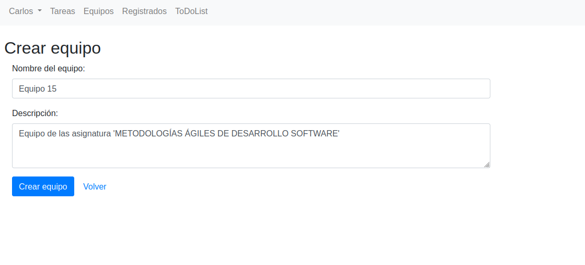

# ToDoList 1.3.0

Esta versión de la aplicación incorpora **3 nuevas _features_** 

- [Docker Hub](#docker-hub)
  - [Despliegue en producción](#despliegue-en-produccin)
    - [Esquemas de la base de datos](#esquemas-de-la-base-de-datos)
    - [Diferencias 1.2.0 - 1.3.0](#diferencias-120---130)
- [011 Descripción de equipos](#011-descripción-de-equipos)
    - [Entidad _Equipo_](#entidad-equipo)
    - [Servicio _EquipoService_](#servicio-equiposervice)
    - [Controller, vista y _DTO_ EquipoData](#controller-vista-y-dto-equipodata)
- [012 Gestión de equipos por administradores](#012-gestión-de-equipos-por-administradores)
    - [Controladores](#controladores)
    - [Vistas](#vistas)
- [013 Información de entidades](#013-información-de-entidades)
    - [Rutas - Controladores](#rutas---controladores)
    - [Vistas](#vistas-1)
    - [Tests](#tests)

# Docker Hub
``` 
https://hub.docker.com/r/sergioaluua/mads-todolist-equipo15
```
# Despliegue en producción
Se han añadido los siguientes schemas de la base de datos: 
- schema-1.2.0 -> Schema de la versión 1.2.0
- schema-1.3.0 -> Schema de la versión 1.3.0
- schema-1.2.0-1.3.0 -> Script de migración de versión 1.2.0 a 1.3.0

Se han añadido los siguientes backups:
- backup17112022.sql -> Contiene un backup con datos de la versión 1.2.0
- backup22112022.sql -> Contiene un backup con los datos del script anterior y nuevos para la versión 1.3.0

### Esquemas de la base de datos
### 1. Schema 1.2.0


### 1. Schema 1.3.0


### Diferencias 1.2.0 - 1.3.0
Se ha añadido a la columna a la tabla equipo.
```sql
descripcion varchar(255)
```
El script de migración contiene: 
```sql 
ALTER TABLE public.equipos
ADD COLUMN descripcion character varying(255)
```

# 011 Descripción de equipos
De ahora en adelante los equipos podrán tener -de forma opcional- una descripción. Al momento de crear un equipo se le podrá detallar la descripción, por lo un usuario cualquiera (no administrador) solo tendrá la opción de detallar la descripción cuando crea el equipo. De ahí en adelante, la descripción solo podrá ser editada por el administrador.

Esta funcionalidad se ha implementado aplicando _TDD_ en las capas de modelo y servicio.

### Entidad _Equipo_

Ya que se tomó la decision de que la descripción sea un atributo opcional en la construcción de un equipo, creamos el primer test que comprueba que el atributo se ha inicializado por defecto en el constructor.

```java
@Test
public void crearEquipoDescripcionNull() {
    Equipo equipo = new Equipo("Proyecto P1");
    assertThat(equipo.getDescripcion()).isNull();
}
```
Se ha incorporado el atributo **descripcion** a la clase **Equipo**. En el constructor de clase se inicializa por defecto a _null_, de este modo mantenemos la signatura del constructor intacta. 

```java
private String descripcion;

public Equipo(String nombre){
    this.nombre = nombre;
    this.descripcion = null;
}

public String getDescripcion() {
    return this.descripcion;
}
```

En posteriores iteraciones aplicando _TDD_ se incluye el _setter_ del atributo y se testea que se guarda correctamente en base de datos.

### Servicio _EquipoService_

Para los métodos de servicio se barajaron varias opciones:

**Modificar la signatura del servicio**

El servicio *crearEquipo()* recibe únicamente el nombre del equipo a crear. Si añadimos un segundo parámetro nos vemos obligados a modificar todos los clientes del servicio, tanto en código de aplicación como en código de tests (unas 70 llamadas al servicio en total).

```java
public Equipo crearEquipo(String nombre)
```

Además, habría que hacer lo propio con el servicio encargado de modificar el equipo.

```java
public Equipo modificarEquipo(Long equipoId, String nombre)
```

Por lo que se descartó esta opción.

**Añadir un servicio específico para modificar la descripción**

Otra opción habría sido implementar un servicio tipo **modificarDescripcionEquipo()** que se encargase únicamente dicha tarea. Pero si en un futuro añadimos más atributos a la clase, siguiendo con esta opción iríamos incrementando innecesariamente la clase _EquipoService_, añadiendo un _setter_ por cada nuevo atributo que queremos modificar.

**Sobreescribir los métodos de servicio**

Finalmente se decidió por sobreescribir los métodos de servicio *crearEquipo()* y *modificarEquipo()*

```java
public Equipo crearEquipo(String nombre, String descripcion) {
    if(nombre == "") throw new EquipoServiceException("El nombre del equipo no puede estar vacio");
    Equipo e = new Equipo(nombre);
    e.setDescripcion(descripcion);
    equipoRepository.save(e);
    return e;
}
```

De este modo no necesitamos modificar todos los tests que invocan a la función, solo el controller que se encarga de la petición _http_. Se da la opción así de crear un Equipo con o sin descripción.

Aunque esta opción es la que menos modifica el código existente, sigue siendo poco mantenible en el tiempo si se van incluyendo atributos a la clase.

Quizá la opción más interesante sería que los métodos de servicio recibiesen un _DTO_ con los campos con los que se desea crear/modificar el objeto. De este modo nos cubrimos las espaldas si en el futuro vamos añadiendo más atributos a la clase.

Un ejemplo de test que prueba la sobreescritura del método:

```java
@Test
public void crearEquipoConDescripcion() {
    Equipo equipo = equipoService.crearEquipo("Proyecto 1", "Equipo de la asignatura MADS");
    Equipo equipoBd = equipoService.recuperarEquipo(equipo.getId());
    assertThat(equipoBd).isNotNull();
    assertThat(equipoBd.getNombre()).isEqualTo("Proyecto 1");
    assertThat(equipoBd.getDescripcion()).isEqualTo("Equipo de la asignatura MADS");
}
```

### Controller, vista y _DTO_ EquipoData

La clase **EquipoData** incorpora tambien el atributo **descripcion**.

```java
public class EquipoData {

    private String descripcion;

    public String getDescripcion() {
        return descripcion;
    }
    public void setDescripcion(String descripcion) {
        this.descripcion = descripcion;
    }
}
```

Como hemos comentado anteriormente, el controller encargado de manejar la petición _http_ llama al método sobreescrito:

```java
//Equipo e = equipoService.crearEquipo(equipoData.getNombre());
Equipo e = equipoService.crearEquipo(equipoData.getNombre(), equipoData.getDescripcion());
```

En las vistas de crear, modificar y ver detalles de un equipo se añadió el campo para editar y visualizar la descripción del equipo.



# 012 Gestión de equipos por administradores
En esta historia se pretende que los administradores de la aplicación puedan eliminar a usuarios de un grupo. Anteriormente, para echar a un usuario era necesario eliminar el grupo entero, con esto no haría falta.
### Controladores
- *EquipoController*: Se ha actualizado el middleware `comprobarUsuarioLogeado`. Su antigua función era revisar que el id del usuario logeado coincidia con el parámetro que se le pasaba. Se utiliza en las funciones donde se accede a recursos de los usuarios, de esta forma comprobamos que si no es el mismo lanzamos una excepción con código `HTTP 401 Unauthorized`. Ahora si el usuario logeado es administrador no lanzamos la excepción y le permitimos acceder al recurso.
```java
private void comprobarUsuarioLogeado(Long idUsuario) {
    Long idUsuarioLogeado = managerUserSession.usuarioLogeado();
    if (!managerUserSession.isUsuarioLogeado())
        throw new UsuarioNoLogeadoException();
    Long idUser = managerUserSession.usuarioLogeado();
    Usuario u = usuarioService.findById(idUser);
    if(!u.getIsAdmin()) {
        if (!idUsuario.equals(idUsuarioLogeado))
            throw new UsuarioNoLogeadoException();
    }
}
```

De esta forma conseeguimos que el administrador pueda acceder al controlador `DELETE /equipos/{equipoId}/usuarios/{usuarioId}` que elimina el usuario del equipo.

### Vistas
- *detallesEquipo*: Se ha añadido en la vista un botón solo si el administrador está logeado para cada usuario de la tabla. Esto se hace gracias al código de Thymeleaf
```html
<td th:if="${usuario.isAdmin}">
    <button class="btn btn-danger btn-xs" onmouseover="" style="cursor: pointer;"
            th:onclick="'del(\'/equipos/' + ${equipo.id} + '/usuarios/' + ${usuarioEquipo.id} + '\')'">Eliminar del equipo</button>
</td>
```

La vista quedaría para usuarios sería así:

Y para administradores:


# 013 Información de entidades
En esta historia se pretende añadir una nueva funcionalidad a la vista `Acerca de` que contemple un seguimiento de los usuarios registrados, asi como las tareas y equipos que han sido creadas en nuestra aplicación.

### Rutas - Controladores
Modificado el método `about` para que añada tres nuevos atributos a la vista que calculen el numero de usuarios registrados en la aplicación, el número de tareas totales de los usuarios y el número de equipos totales que han sido creados.

- Calculo de los usuarios registrados y las tareas totales:
```java
Integer numberUser = 0;
        Integer numberTask = 0;
        for(Usuario u :usuarioService.findAll()) {
            numberUser++;
            for (Tarea t : tareaService.allTareasUsuario(u.getId())) {
                numberTask++;
            }
        }
```

### Vistas
- *about*: Añadidos tres elementos a la lista para mostrar el numero de usuarios registrados en la aplicación, el número de tareas totales de los usuarios y el número de equipos totales que han sido creados.
```html
<h1>ToDoList</h1>
      <ul>
        <li>Desarrollada por Equipo 15: </li>
        <li>Sergio Baeza Carrasco</li>
        <li>Eugenio Benito López</li>
        <li>Álvaro Lario Sánchez</li>
        <li>Versión 1.3.0-SNAPSHOT</li>
        <li>Fecha de release: en desarrollo</li>
        <li>Usuarios registrados: <span th:text="${numberUser}"></span></li>
        <li>Tareas registradas: <span th:text="${numberTask}"></span></li>
        <li>Equipos registrados: <span th:text="${numberTeam}"></span></li>
      </ul>
```

### Tests
Hemos añadido un método en la clase `AcercaDeWebTest` que compruebe el funcionamiento de nuestra nueva funcionalidad.

```java
@Test
    public void testShowEntityAmount() throws Exception {

        this.mockMvc.perform(get("/about"))
                .andExpect(content().string(allOf(containsString("<li>Usuarios registrados: <span>0</span></li>"),
                        containsString("<li>Tareas registradas: <span>0</span></li>"),
                        containsString("<li>Equipos registrados: <span>0</span></li>"))));

        Usuario invitado = new Usuario("als106@alu.ua.es");
        invitado.setPassword("123");
        invitado = usuarioService.registrar(invitado);

        Tarea task1 = tareaService.nuevaTareaUsuario(invitado.getId(),"Task 1");

        Equipo equipoA  = equipoService.crearEquipo("Equipo A");
        Equipo equipoB  = equipoService.crearEquipo("Equipo B");

        this.mockMvc.perform(get("/about"))
                .andExpect(content().string(allOf(containsString("<li>Usuarios registrados: <span>1</span></li>"),
                        containsString("<li>Tareas registradas: <span>1</span></li>"),
                        containsString("<li>Equipos registrados: <span>2</span></li>"))));
    }
```
